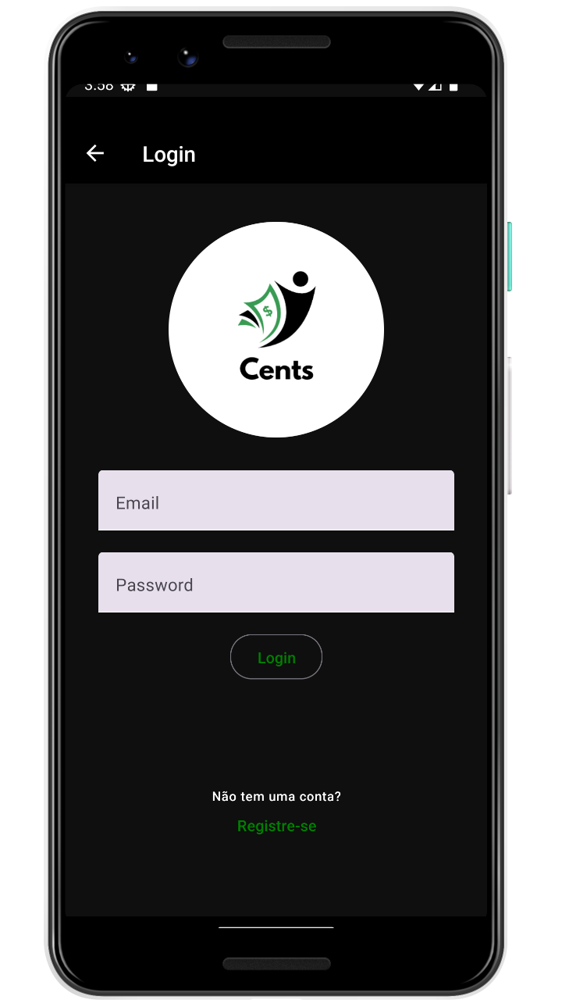
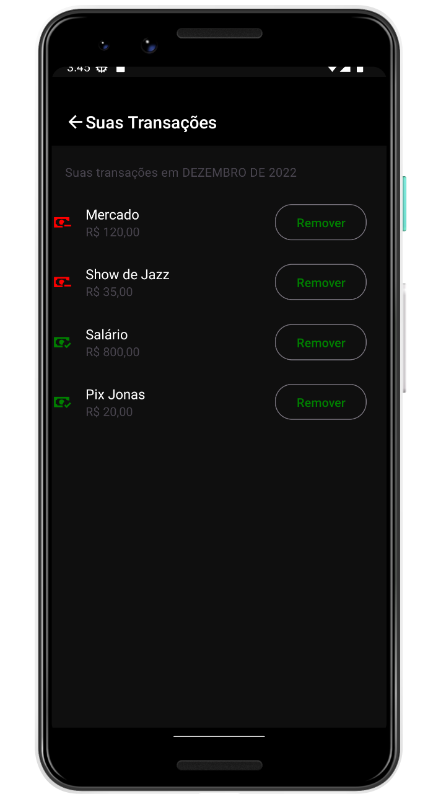

<p align="center">
   
</p>

<p align="center">
  
</p>

> <b>ig.news</b> Aplicativo para gerenciamento de gastos, com criação de conta e integração com Firebase

# :pushpin: Conteúdo

- [Tecnologias](#computer-tecnologias)
- [Executando](#construction_worker-executando)
- [Autores](#computer-autores)
- [Licença](#closed_book-licença)

### Fotos

<div>
   
   
   
   
</div>

# :computer: Tecnologias

Este projeto foi feito utilizando as seguintes tecnologias:

- [React Native](https://reactjs.org/)
- [Typescript](https://www.typescriptlang.org/)
- [Firebase](https://www.typescriptlang.org/)
- [Expo](https://nextjs.org/)
- [React Query](https://nextjs.org/)
- [React Native Paper](https://nextjs.org/)
- [ESLint](https://eslint.org/)
- [Prettier](https://prettier.io/)

# :construction_worker: Executando

```bash
# Baixe as dependendências
$ npm install
```

```bash
# Build das dependencias nativas
$ npm run android
```

```bash
# Execute
$ npm run start
```

# :closed_book: Licença

Este projeto está sob a licença [MIT](./LICENSE).
